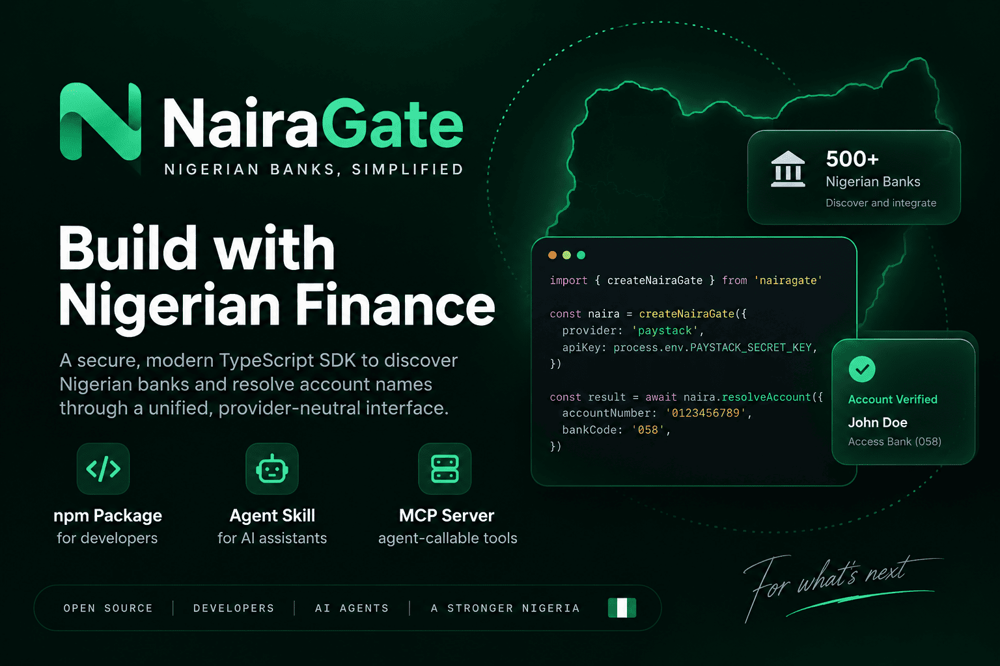

<p align="center">
  
</p>

# NairaGate

[](https://github.com/Tee-David/NairaGate/actions/workflows/ci.yml)
[](https://www.npmjs.com/package/nairagate)
[](LICENSE)
[](package.json)

Nigerian bank infrastructure for developers and AI agents. Discover Nigerian banks and resolve account names through a secure, typed, provider-neutral interface.

Use NairaGate as a TypeScript SDK, an Agent Skill, or an MCP server for compatible AI applications.

**Created and maintained by Taiwo David Dayomola, Senior Software Engineer.**

> **Status:** Pre-1.0 and under active development. Paystack and Flutterwave are implemented. Other native provider support is on the roadmap. See [ROADMAP.md](ROADMAP.md).

## Install

```bash
npm install nairagate
```

Requires Node.js 20 or newer.

## TypeScript SDK

```ts
import { createNairaGate, PaystackProvider } from "nairagate";

const secretKey = process.env.PAYSTACK_SECRET_KEY;
if (!secretKey) throw new Error("PAYSTACK_SECRET_KEY is required.");

const nairaGate = createNairaGate({
  provider: new PaystackProvider({ secretKey }),
});

const banks = await nairaGate.banks.list();
const account = await nairaGate.accounts.resolve({
  accountNumber: "0123456789",
  bankCode: "058",
});
```

Swap in `FlutterwaveProvider` to use Flutterwave instead. The application-facing API is identical; only the provider you construct changes:

```ts
import { createNairaGate, FlutterwaveProvider } from "nairagate";

const secretKey = process.env.FLUTTERWAVE_SECRET_KEY;
if (!secretKey) throw new Error("FLUTTERWAVE_SECRET_KEY is required.");

const nairaGate = createNairaGate({
  provider: new FlutterwaveProvider({ secretKey }),
});
```

Keep provider credentials server-side. Never place a provider secret key in browser code, mobile code, prompts, logs, or committed files.

## MCP server

The npm package includes the `nairagate-mcp` stdio MCP server. It exposes the same NairaGate core to compatible AI clients without giving the model direct access to provider credentials.

Set the provider credential in the environment of the process running the MCP server. By default the server starts with Paystack:

```bash
PAYSTACK_SECRET_KEY=your_secret_key npx -y nairagate nairagate-mcp
```

Set `NAIRAGATE_PROVIDER=flutterwave` to start it with Flutterwave instead:

```bash
NAIRAGATE_PROVIDER=flutterwave FLUTTERWAVE_SECRET_KEY=your_secret_key npx -y nairagate nairagate-mcp
```

When configuring an MCP client, use `npx` as the command, pass `-y`, `nairagate`, and `nairagate-mcp` as arguments, and provide the matching secret key through that client's secure environment configuration. Do not put the key in prompts or repository files.

### MCP tools

| Tool              | Purpose                                                       | Input                       |
| ----------------- | ------------------------------------------------------------- | --------------------------- |
| `list_banks`      | List Nigerian banks available through the configured provider | None                        |
| `resolve_account` | Resolve an account holder name                                | `accountNumber`, `bankCode` |

Both tools are read-only from the MCP client's perspective. Account numbers and resolved names should still be treated as privacy-sensitive financial data.

## Agent Skill

The repository ships an Agent Skill at [`skills/nairagate/SKILL.md`](skills/nairagate/SKILL.md). It teaches compatible coding agents how to integrate and review NairaGate safely, including credential handling, input validation, provider boundaries, privacy-sensitive logging, MCP usage, and the distinction between implemented and roadmap providers.

Install it from the repository with a compatible Agent Skills installer:

```bash
npx skills add https://github.com/Tee-David/NairaGate --skill nairagate
```

The skill contains integration guidance, not credentials. Actual bank operations still run through trusted server-side NairaGate code or the MCP server.

## The problem

NairaGate started with a problem I ran into while building a Nigerian fintech product. I needed reliable bank account-name verification, but getting from a simple product requirement to a dependable implementation meant dealing with access and onboarding constraints, provider-specific authentication, different response shapes, inconsistent failure handling, and security decisions that had little to do with the feature I was actually trying to ship.

I built the integration I needed on the spot. Once it worked, the architectural problem became obvious: that solution should not stay buried inside one application, and the next Nigerian developer should not have to rebuild the same provider plumbing from scratch.

Building Nigerian fintech, payments, onboarding, payout, marketplace, or financial-testing flows often requires the same deceptively simple capability: given a bank and account number, resolve the account holder's name before continuing. Direct financial-infrastructure integrations are not always appropriate for an early product, prototype, internal tool, test environment, or developer who is not yet ready to complete an institution-level integration process.

**NairaGate turns that repeated integration work into a small, typed, security-conscious abstraction.**

## Architecture

```text
                    +-- TypeScript / npm SDK
                    |
Application/Agent --+-- NairaGate Agent Skill
                    |
                    +-- MCP / Agent Tools
                              |
                         NairaGate Core
                              |
                      Provider Interface
                       |             |
                   Paystack     Flutterwave
                  implemented   implemented
```

Your application depends on NairaGate's stable domain contract. Provider adapters own provider-specific authentication, endpoints, payloads, response normalization and failure mapping. The SDK, Skill and MCP interface all converge on the same core rather than creating separate banking implementations.

NairaGate is not a replacement for NIBSS, a bank, regulatory compliance, KYC obligations, or a payment processor. It does not bypass institutional requirements or provider authorization. It reduces application-level integration friction for developers using providers they are authorized to access.

## Why use it?

- Build and test Nigerian account-verification flows without coupling your application directly to one provider's response format.
- Keep provider credentials and financial API calls in trusted server-side code.
- Validate account inputs before making upstream requests.
- Receive predictable typed errors instead of scattering provider-specific failure handling across your application.
- Use the same core from application code or compatible AI tooling.
- Swap or add providers behind a common contract as NairaGate grows.
- Mock the network boundary for deterministic tests without calling live banking APIs.

## Provider status

| Provider               | Bank discovery | Account resolution | Status      |
| ---------------------- | -------------- | ------------------ | ----------- |
| Paystack               | Yes            | Yes                | Implemented |
| Flutterwave            | Yes            | Yes                | Implemented |
| Other native providers | Planned        | Planned            | Roadmap     |

The Flutterwave adapter is built against Flutterwave's publicly documented v3 REST API (`GET /v3/banks/NG`, `POST /v3/accounts/resolve`) and is covered by deterministic tests with no live financial calls. It has not yet been exercised against a live Flutterwave key — do so in your own sandbox before production use.

A provider appearing on the roadmap does not mean it is currently supported. New integrations are only marked implemented after the adapter, error mapping, documentation and automated tests are complete.

## Development commands

```bash
npm ci              # reproducible dependency install
npm run check       # complete quality gate
npm run test        # deterministic test suite
npm run typecheck   # TypeScript validation
npm run lint        # ESLint
npm run format      # Prettier verification
npm run build       # compile distributable files
npm pack --dry-run  # inspect npm package contents
```

The complete quality gate checks formatting, linting, TypeScript, tests, the package build and production dependency audit.

## Security is part of the API

Account-name resolution can expose personal information and can become an enumeration surface if an application publishes it without controls. NairaGate validates inputs and normalizes provider failures, but it cannot know your application's users, authorization model, or distributed infrastructure.

Before exposing resolution over HTTP or through an agent-facing service, implement the appropriate authentication or authorization boundary, per-user and per-IP rate limiting, abuse monitoring, conservative retries, and privacy-aware logging. Do not log complete account numbers and resolved names unless your application has a justified need and an appropriate retention policy.

Read [SECURITY.md](SECURITY.md) and the [security guide](docs/security.md) before production use.

## Documentation and examples

- [Getting started](docs/getting-started.md)
- [API reference](docs/api-reference.md)
- [Architecture](docs/architecture.md)
- [Security guide](docs/security.md)
- [Agent Skill](skills/nairagate/SKILL.md)
- [Roadmap](ROADMAP.md)
- [Contributing](CONTRIBUTING.md)
- [Changelog](CHANGELOG.md)
- [Next.js route handler](examples/nextjs/app/api/banks/resolve/route.ts)
- [Minimal Node HTTP server](examples/node-http/server.ts)

## Contributing

NairaGate welcomes useful, reviewed contributions, but changes do not go directly into the maintained codebase merely because a pull request is opened.

Start by reading [CONTRIBUTING.md](CONTRIBUTING.md). For non-trivial changes, open an issue first so the problem and proposed API can be discussed. Contributors should fork the repository, create a focused branch in their fork, add tests and documentation where required, run the complete quality gate, and then submit a pull request for maintainer review.

Every accepted change must preserve the project's architecture and security guarantees and pass automated checks. Provider integrations require deterministic tests and documentation before they are considered supported.

## Project status

NairaGate is being developed from a real integration problem encountered while building software in the Nigerian payments ecosystem. The public repository contains no credentials or application-specific production data from the original integration.

The project is pre-1.0. APIs may evolve while the provider model, security behavior and developer experience are hardened. Changes are recorded in [CHANGELOG.md](CHANGELOG.md).

## Author and maintainer

**Taiwo David Dayomola**  
Senior Software Engineer

NairaGate was conceived, designed and built by Taiwo David Dayomola to reduce repeated integration work around Nigerian bank discovery and account verification and to provide a reusable foundation that can grow across supported providers.

## License

Licensed under the Apache License 2.0. See [LICENSE](LICENSE).
